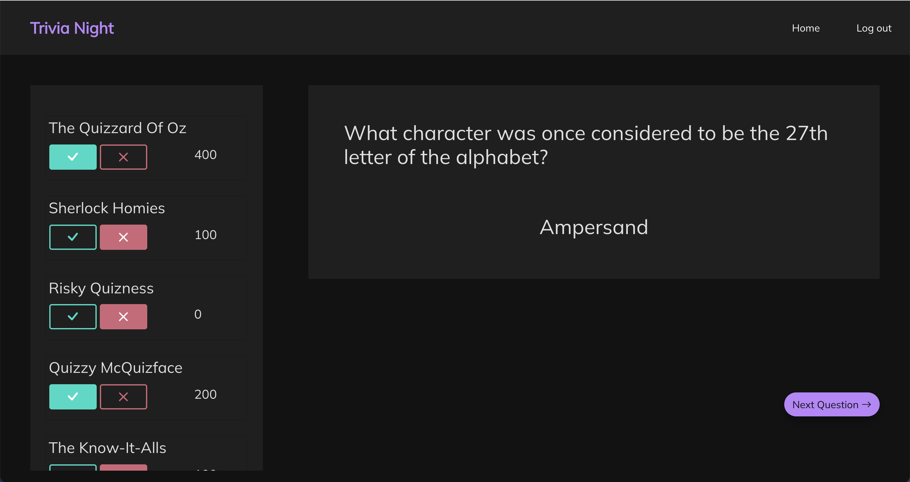

# Trivia Night

See the [deployed app](https://trivia-night-1.herokuapp.com/)

[Link](https://github.com/mckennapenley/trivia-night-react) to Ruby on Rails backend

#

## About

Trivia Night is an app that allows restaurants and bars to host their own team trivia night. Select question difficulty, number of questions, and enter as many teams as you want. Trivia Night will keep track of team score and reveal team rankings at the end!

Builts with:

- Ruby on Rails
- React
- PostgreSQL
- HTML, CSS, BootStrap
- OpenTriviaDB API

#

## Screenshot

#

## Future Enhancements

- Add capability to present questions with multiple choice answers
- Create Question has many Responses relationship so users can see and edit previous responses to previous questions
- Add timer countdown clock
- Add ability to show/hide answer
